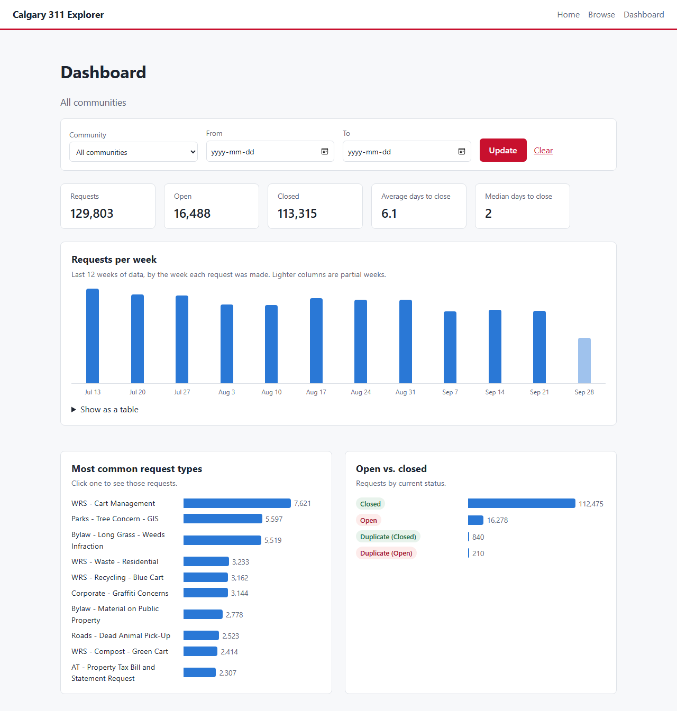
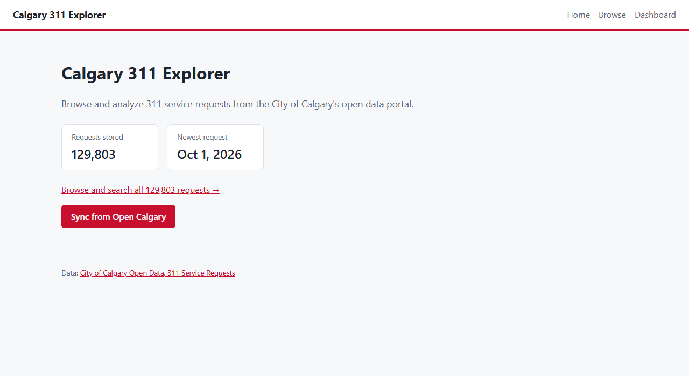
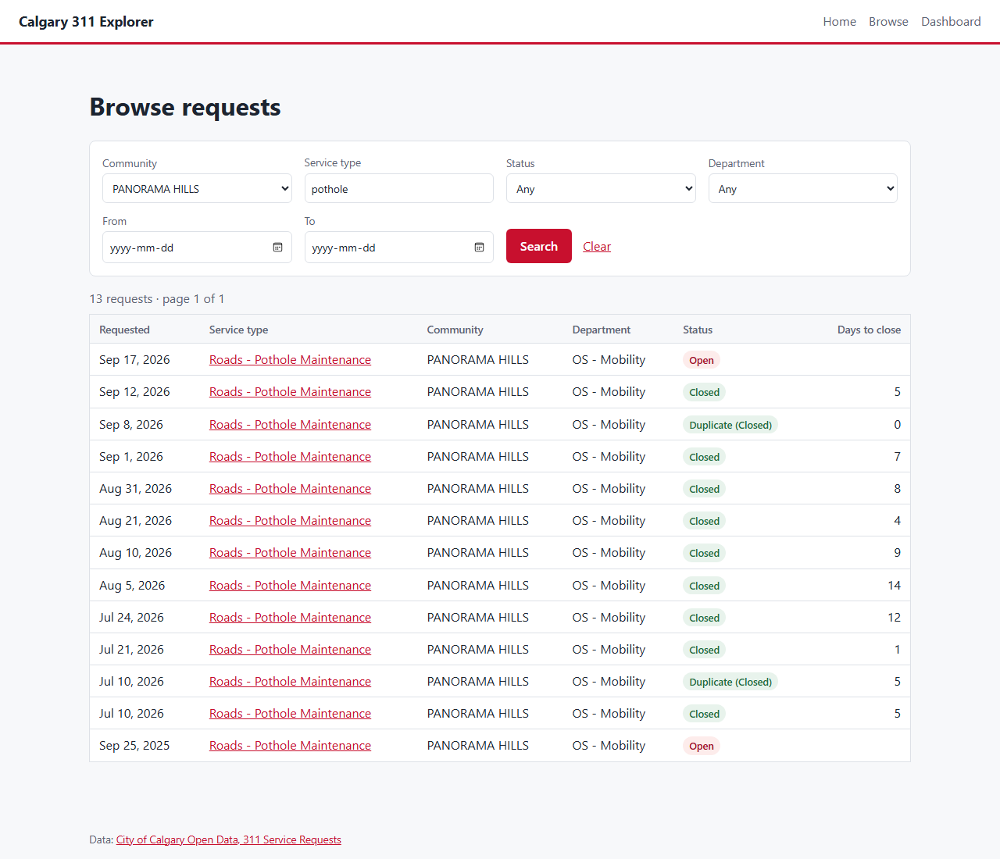
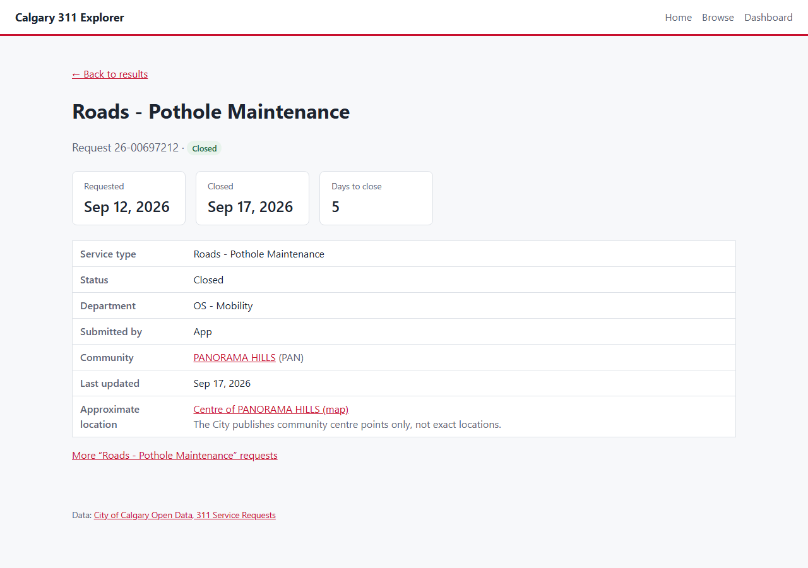

# Calgary 311 Explorer

[](https://github.com/TavishHanda/calgary-311-explorer/actions/workflows/ci.yml)

A web app for browsing and analyzing the City of Calgary's 311 service requests. It pulls live data from the City's open data portal, stores it locally, and lets you search requests by community, service type and status, and see how long each department takes to close them.

Built with C#, ASP.NET Core Razor Pages, Entity Framework Core and SQLite.



## Features

- **Sync from Open Calgary:** loads recent 311 requests from the City's API in pages and updates existing records instead of duplicating them. Later syncs only fetch what changed since the last one. Runs automatically when the app starts and every night, or on demand from the home page.
- **Browse and search:** filter requests by community, service type, status, department and date range, with a detail page for each request.
- **Dashboard:** requests per week, the most common request types, open vs. closed, and median and average days to close by department, for the whole city or one community.
- **REST API:** `GET /api/requests?community=Panorama Hills&status=Open` returns matching requests as JSON, with paging.
- **Tests:** 36 xUnit tests covering data mapping, the sync, filters, dashboard calculations and the API (integration tests that run the whole app in memory).

## Walkthrough

**1. Load the data.** The home page shows how many requests are stored. **Sync from Open Calgary** loads the last 90 days (about 130,000 requests, a few minutes the first time); after that, a sync takes seconds because it only asks for requests updated since the newest one stored.



**2. Browse and filter.** The Browse page lists requests newest first, 50 per page. Filters can be combined, and they live in the URL, so any search can be bookmarked or shared. Here: pothole requests in Panorama Hills.



**3. Look at one request.** Each request has a page with its dates, how long it took to close (or how long it's been open), the department, how it was submitted, and links to similar requests.



**4. See the patterns.** The dashboard (top of this page) summarizes every request or one community's. Clicking a request type, status or department opens Browse with that filter applied.

## The data

The app uses the [311 Service Requests](https://data.calgary.ca/Services-and-Amenities/311-Service-Requests/iahh-g8bj) dataset (ID `iahh-g8bj`) from the City of Calgary's Open Data Portal. It covers requests from 2012 to the present, updates daily, and has over 7 million rows, so the app loads a recent window (90 days by default, about 130,000 requests).

The dataset is served through a Socrata API that returns JSON and accepts SoQL query parameters. For example, the five newest requests:

```
https://data.calgary.ca/resource/iahh-g8bj.json?$order=requested_date DESC&$limit=5
```

| API field | Model property | Example |
| --- | --- | --- |
| `service_request_id` | `ServiceRequestId` | Unique ID from the City |
| `requested_date` | `RequestedDate` | 2026-10-01 |
| `updated_date` | `UpdatedDate` | |
| `closed_date` | `ClosedDate` | Empty while open |
| `status_description` | `Status` | Open, Closed |
| `source` | `Source` | Phone, App, Other |
| `service_name` | `ServiceName` | Roads - Traffic Signal Construction Inquiry |
| `agency_responsible` | `AgencyResponsible` | OS - Mobility |
| `address` | `Address` | Always empty in practice |
| `comm_code` / `comm_name` | `CommunityCode` / `CommunityName` | PAN / PANORAMA HILLS |
| `longitude` / `latitude` | `Longitude` / `Latitude` | The community's centre point |

Things worth knowing about the data:

- **Locations are approximate.** The City publishes the centre point of the request's community, never the exact location, and leaves `address` empty. Across all 7.5 million rows, `location_type` is only ever `Community Centrepoint` or `None`. The app labels coordinates as approximate for this reason.
- **Status, not closed date, decides open vs. closed.** Some reopened requests say "Open" but still have a closed date, so the dashboard goes by status.
- **Longitude and latitude arrive as strings**, and dates have no time part (`2026-10-01T00:00:00.000`).

## Tech stack

| Layer | Technology |
| --- | --- |
| Language | C# (.NET 10) |
| Web framework | ASP.NET Core Razor Pages |
| Data access | Entity Framework Core |
| Database | SQLite |
| HTTP | HttpClient with System.Text.Json |
| Testing | xUnit, WebApplicationFactory (integration tests) |
| Tools | Visual Studio, Git, GitHub |

## Getting started

### Prerequisites

- [.NET SDK](https://dotnet.microsoft.com/download) (10.0 or later)
- Visual Studio 2022 or later with the **ASP.NET and web development** workload, or VS Code with the C# Dev Kit extension

### Run it locally

```bash
git clone https://github.com/TavishHanda/calgary-311-explorer.git
cd calgary-311-explorer

# First time only: install the EF Core tools and create the database from the migrations
dotnet tool install --global dotnet-ef
cd src/Calgary311.Web
dotnet ef database update

dotnet run
```

Open the URL shown in the terminal (usually `http://localhost:5000`). The app starts loading the last 90 days of requests in the background straight away; the first sync takes a few minutes, and later ones only fetch what changed.

### API

All endpoints return JSON.

| Endpoint | What it returns |
| --- | --- |
| `GET /api/requests` | A page of requests, newest first |
| `GET /api/requests/{id}` | One request by its City ID, or 404 |

`/api/requests` takes the same filters as the Browse page, all optional and not case-sensitive: `community`, `serviceType` (matches part of the name), `status`, `department`, `from` and `to` (dates, `yyyy-MM-dd`), plus `page` and `pageSize` (default 50, max 500).

```
GET /api/requests?community=Panorama Hills&status=Open&pageSize=2
```

```json
{
  "page": 1,
  "pageSize": 2,
  "totalCount": 126,
  "totalPages": 63,
  "items": [
    {
      "serviceRequestId": "26-00746540",
      "requestedDate": "2026-10-01T00:00:00",
      "closedDate": null,
      "daysToClose": null,
      "status": "Open",
      "serviceName": "Bylaw - Material on Public Property",
      "agencyResponsible": "CS - Emergency Management and Community Safety",
      "communityName": "PANORAMA HILLS",
      "...": "..."
    }
  ]
}
```

### Run the tests

From the repository root:

```bash
dotnet test
```

### Configuration

Settings live in `src/Calgary311.Web/appsettings.json` under `OpenCalgary`:

| Setting | Default | What it does |
| --- | --- | --- |
| `DatasetId` | `iahh-g8bj` | The 311 dataset to load |
| `InitialSyncDays` | `90` | How many days of requests the first sync loads |
| `PageSize` | `5000` | Rows per API request |
| `AppToken` | empty | Optional [Socrata app token](https://dev.socrata.com/docs/app-tokens.html) for higher rate limits |
| `AutoSync` | `true` | Sync when the app starts and once a day |
| `DailySyncTime` | `03:00` | Local time of the daily sync |

GitHub Actions builds the solution and runs the tests on every push to `main` and on pull requests (`.github/workflows/ci.yml`). Warnings fail the build.

## Project structure

```
calgary-311-explorer/
├── Calgary311Explorer.slnx
├── src/
│   └── Calgary311.Web/
│       ├── Api/                  # JSON endpoints and response types
│       ├── Data/                 # AppDbContext
│       ├── Migrations/           # EF Core migrations (database schema history)
│       ├── Models/               # ServiceRequest
│       ├── Services/             # Sync, filters, dashboard calculations
│       ├── Pages/                # Razor Pages: Home, Requests (Browse, Details), Dashboard
│       ├── wwwroot/css/          # Styles
│       ├── OpenCalgaryOptions.cs # Open Calgary API settings
│       └── Program.cs            # Startup: services and endpoints
├── tests/
│   └── Calgary311.Tests/         # xUnit unit and integration tests
└── docs/
    └── screenshots/
```

## Roadmap

- [x] **1. Setup:** solution, web and test projects, `ServiceRequest` model, `AppDbContext`, starter page
- [x] **2. Database:** first migration (`InitialCreate`) and database created locally
- [x] **3. Sync service:** fetch requests from the API in pages, map JSON to `ServiceRequest`, insert new rows and update changed ones; a button or command to run it
- [x] **4. Browse page:** table of requests with filters (community, service type, status, department, date range) and paging
- [x] **5. Request detail page:** everything known about one request
- [x] **6. API endpoint:** `GET /api/requests` with the same filters
- [x] **7. Dashboard:** top service types, open vs. closed, average days to close by department
- [x] **8. Tests:** 8–10 xUnit tests on mapping, filters and dashboard calculations (ended up with 36)
- [x] **9. Docs:** screenshots and a short walkthrough in this README

- [x] **Extra:** automatic daily sync, and builds and tests on GitHub Actions

Next: deployment to Azure App Service. A map is less useful than planned, since every request in a community shares one point.

## What I learned

_To fill in once built: what was new coming from Java, working with a real public API, and what I'd do differently._

## Data license

Contains information licensed under the City of Calgary's open data terms of use. See the [dataset page](https://data.calgary.ca/Services-and-Amenities/311-Service-Requests/iahh-g8bj) for details.

## Author

**Tavish Handa** · [LinkedIn](https://www.linkedin.com/in/tavish-handa) · [GitHub](https://github.com/TavishHanda)
